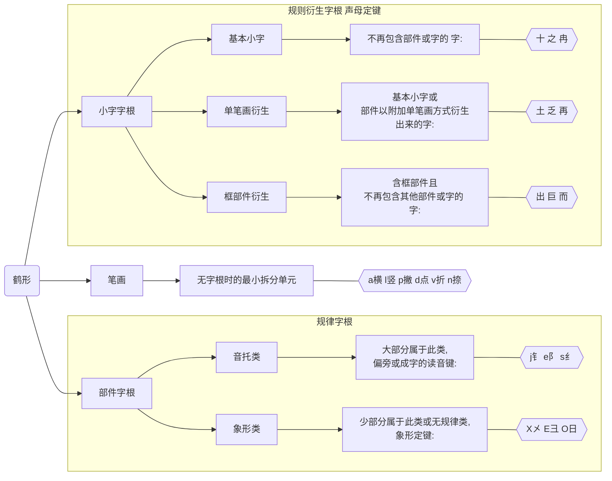

```mermaid 
flowchart LR 

%% s=start n=normal f=fork c=convergence 

%% 主图 

s(鹤形)-->n1[笔画]-->n2[无字根时的最小拆分单元<br>]---n3{{"a横 l竖 p撇 d点 v折 n捺"}}; 

%% 上面增加了主图线条长度 

%% 主图分支 

s-->f1[部件字根]; 
s-->f2[小字字根]; 

%% 子图1 
subgraph 规律字根 

f1-->n4[音托类]-->n5[大部分属于此类,<br>偏旁或成字的读音键:]---n6{{"j钅 e⻖ s纟"}}; 
f1-->n7[象形类]-->n8[少部分属于此类或无规律类,<br>象形定键:]---n9{{"X㐅 E彐 O日"}}; 
end 

%% 子图2 
subgraph 规则衍生字根 声母定键 

f2-->n10[基本小字]-->n11[不再包含部件或字的 字:]---n12{{十 之 冉}}; 
f2-->n13[单笔画衍生]-->n14[基本小字或<br>部件以附加单笔画方式衍生出来的字:]---n15{{土 乏 再}};
f2-->n16[框部件衍生]-->n17[含框部件且<br>不再包含其他部件或字的 字:]---n18{{出 巨 而}}; 
end

```