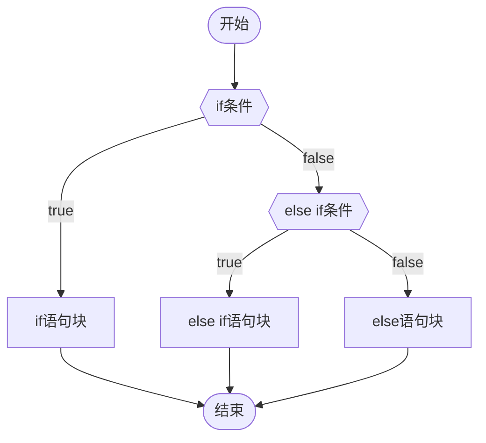

```mermaid 
graph TB 
%% s=start e=end f=fork n=normal 

s([开始])-->f1{{if条件}}; 

%% 分支点1 

f1--true-->n1[if语句块]-->e([结束]); 
f1--false-->f2{{else if条件}}; 

%% 分支点2 

f2--true-->n2[else if语句块]-->e; 
f2--false-->n3[else语句块]-->e; 

```
