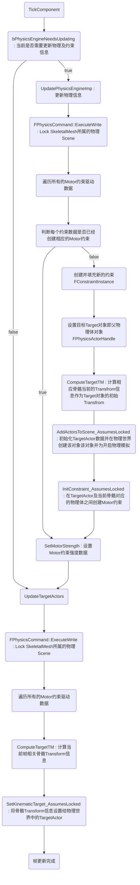

---
tags:
  - ue unreal animation physics PhysicaAnimation
---

# 1. 概述

UPhysicalAnimationComponent组件是UnrealEngine自带的一个物理动画组件，其基本原理是：通过设置额外的MotorConstraint控制/驱动物理体趋近于该物理体对应骨骼在关键帧动画中的位置和朝向。
也就是说，该组件会为指定的骨骼/物理体创建额外的MotorConstraint约束，该约束的父对象是由本组件创建的一个半径为0的球体对象(该球体对象不响应物理并且由UPhysicalAnimationComponent组件每帧根据动画骨骼数据更新其Transform信息)，该约束的子对象即为指定骨骼对应的物理体。我们在外部逻辑通过调整控制约束的强度参数控制MotorConstraint驱动物理体到动作Pose的强弱，而UPhysicalAnimationComponent组件每帧则会通过从SkeletalMeshComponent中获取骨骼信息(骨骼动画更新后的骨骼Transform)并将其填充给约束目标对象，从而驱动最终的物理动画效果。

# 2. 基本流程

由于UPhysicalAnimationComponent组件的工作原理是通过MotorConstraint驱动物理体拟合骨骼动画，因此该组件对外提供给的主要接口就是设置骨骼约束参数强度等，如下表所示：

|   |   |
|---|---|
|函数名||功能说明|
|SetSkeletalMeshComponent|指定SkeletalMesh组件，逻辑中将从SetSkeletalMeshComponent中获取及设置物理体及约束信息.|
|ApplyPhysicalAnimationSettingsBelow()|为指定骨骼及其子骨骼设置约束数据信息|
|SetStrengthMultiplyer()|设置约束参数强度系数|
|ApplyPhysicalAnimationProfileBelow()|指定骨骼以及其子骨骼使用特定的约束配置|
|GetBodyTargetTransform|获取指定物理体的MotorTarget目标Transform(若指定物理体未进行物理模拟则直接返回骨骼Transform)|

外部逻辑根据需要设置好需要进行物理模拟的骨骼及约束信息后，UPhysicalAnimationComponent将在每帧Tick中处理物理动画的具体逻辑，其工作流程如下图所示：

