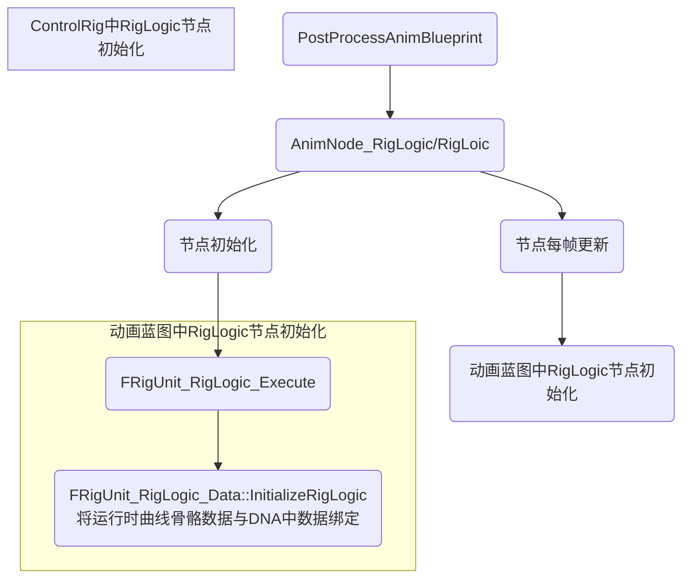
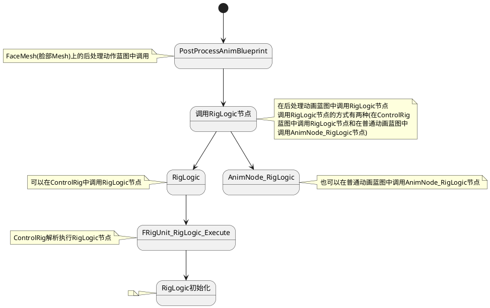

```mermaid 
flowchart TD 

%% s=start n=normal f=fork c=convergence 

%% 主图 在后处理蓝图中通过调用RigLoigc节点或者在ControlRig中调用RigLogic节点实现面部表情控制

s(PostProcessAnimBlueprint)-->n1(AnimNode_RigLogic/RigLoic)

%% 初始化RigLogic

n1-->n3(节点初始化)
n1-->n4(节点每帧更新)

%% 初始化流程

n3-->f1(FRigUnit_RigLogic_Execute); 
n4-->f2(动画蓝图中RigLogic节点初始化); 

%% 子图1 
subgraph ControlRig中RigLogic节点初始化 

end 

%% 子图2 
subgraph 动画蓝图中RigLogic节点初始化

f1-->c(FRigUnit_RigLogic_Data::InitializeRigLogic将运行时曲线骨骼数据与DNA中数据绑定)
end

```

``` plantuml
@startuml

[*] --> PostProcessAnimBlueprint
PostProcessAnimBlueprint --> 调用RigLogic节点

note left of PostProcessAnimBlueprint : FaceMesh(脸部Mesh)上的后处理动作蓝图中调用

note right of 调用RigLogic节点
在后处理动画蓝图中调用RigLogic节点
调用RigLogic节点的方式有两种(在ControlRig
蓝图中调用RigLogic节点和在普通动画蓝图中
调用AnimNode_RigLogic节点)
end note

调用RigLogic节点 --> RigLogic

note left of RigLogic
可以在ControlRig中调用RigLogic节点
end note

调用RigLogic节点 --> AnimNode_RigLogic
note right of AnimNode_RigLogic
也可以在普通动画蓝图中调用AnimNode_RigLogic节点
end note

RigLogic --> FRigUnit_RigLogic_Execute
note left of FRigUnit_RigLogic_Execute
ControlRig解析执行RigLogic节点
end note

FRigUnit_RigLogic_Execute --> RigLogic初始化
note left of RigLogic初始化

end note


@enduml

```